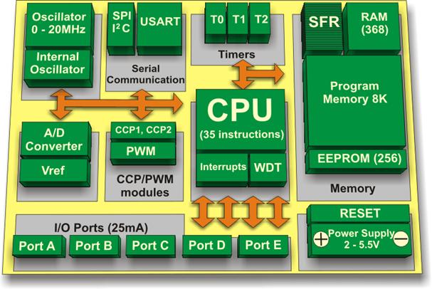
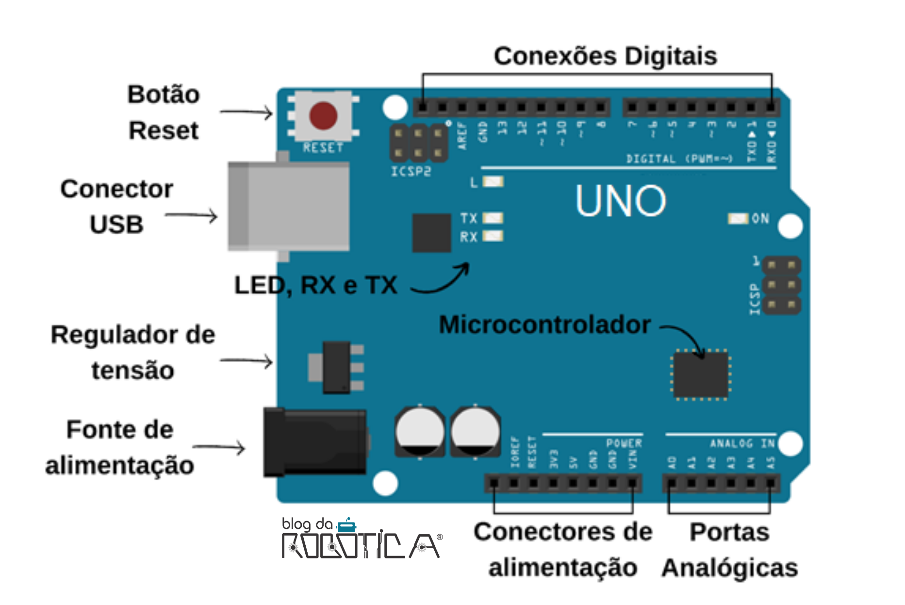

# Microcontroladores: Introdução para autodidatas

Trabalho de Extenção

Jhonata Flores Sande
Tutor. Marco C.

Faculdade Estácio
Programação de Microcontroladores

Vitória da Conquista — BA, 2024

---
## Fundamentos de Microcontroladores

Um microcontrolador é um circuito integrado (chip) que combina uma unidade central de processamento (CPU), memória e periféricos de entrada e saída em um único chip. Essa integração permite que microcontroladores sejam usados em uma ampla variedade de aplicações, desde brinquedos e eletrodomésticos até sistemas industriais e automotivos. Como essas peças funcionam será melhor abordado no Capítulo 4.
Componentes Internos de um Microcontrolador

- Unidade Central de Processamento (CPU): O "cérebro" do microcontrolador, responsável por executar as instruções do programa. A CPU busca as instruções na memória, decodifica-as e as executa.
- Memória:
    - ROM (Read-Only Memory): Armazena as instruções do programa de forma permanente. Uma vez gravadas, as instruções não podem ser alteradas.
    - RAM (Random Access Memory): Armazena os dados que o programa está usando durante a execução. A RAM é volátil, ou seja, os dados são perdidos quando a alimentação é desligada.
- Oscilador: Gera o sinal de clock que sincroniza todas as operações do microcontrolador, a frequência do oscilador determina a velocidadede execução do microcontrolador.
- Periféricos: Módulos que permitem que o microcontrolador interaja com o mundo externo. Exemplos comuns incluem:
    - Portas de entrada/saída: utilizadas para conectar o microcontrolador a outros dispositivos, como sensores e atuadores.
    - Temporizadores: Geram pulsos em intervalos de tempo precisos, utilizados para controlar eventos e medir tempo.
    - Conversores analógico-digitais (ADCs): Converte sinais analógicos (como tensão) em sinais digitais que o microcontrolador pode processar.
    - Módulos de comunicação: permitem a comunicação com outros dispositivos, como UART, I2C, SPI.

Figure 1: arquitetura de um microcontrolador PIC16F887 - fonte Scrigroup

#### Analise dos componentes da Figure 1

- O número de instruções 35 (Figure 1) indica a complexidade do conjunto de instruções da CPU.
- **Programa Memory (8K):** Armazena o programa que será executado pelo microcontrolador. É geralmente uma memória não volátil (EEPROM ou Flash), o que significa que os dados não são perdidos quando a alimentação é desligada.
- **RAM (368):** Memória de acesso aleatório, usada para armazenar dados temporários durante a execução do programa, como variáveis e resultados de cálculos. É volátil, perdendo os dados quando a alimentação é removida.
- **EEPROM(256):** Memória não volátil de menor capacidade, utilizada para armazenar dados de configuração que precisam ser mantidos mesmo com a alimentação desligada.
- **Timers:** Contadores que podem ser configurados para gerar interrupções em intervalos de tempo específicos. Utilizados em diversas aplicações, como temporização de eventos, geração de PWM (Modulação por Largura de Pulso) e controle de motores.
- **Serial Communication:** Módulos que permitem a comunicação serial com outros dispositivos, como sensores, atuadores e computadores.
    - **SPI (Serial Peripheral Interface):** Protocolo de comunicação síncrono, utilizado para conectar diversos dispositivos a um único mestre.
    - **USART (Universal Synchronous/Asynchronous Receiver/Transmitter):** Protocolo de comunicação assíncrono, utilizado para comunicação serial de longa distância.
- **A/D Converter (ADCs):** Utilizado para ler dados de sensores analógicos, como temperatura, luminosidade, etc.
- **CCP/PWM modules:** Módulos de captura, comparação e geração de PWM, utilizados para controlar a velocidade de motores, gerar sinais PWM para controlar a luminosidade de LEDs, etc.
- **I/O Ports:** Pinos de entrada/saída que permitem ao microcontrolador interagir com o mundo externo.
- **Interrupts:** Mecanismo que permite ao microcontrolador responder a eventos externos, como interrupções de hardware (por exemplo, um botão pressionado) ou interrupções de software (por exemplo, um timer expirando).
- **WDT (Watchdog Timer):** Temporizador que reinicia o microcontrolador se ele ficar preso em um loop infinito ou se ocorrer algum erro de software.

### Ciclo de Máquina

O ciclo de máquina descreve as etapas básicas que um microcontrolador executa para processar uma instrução:

1. Busca de Instrução: A CPU busca a próxima instrução a ser executada na memória e a coloca em um registrador interno.
2. Decodificação: A instrução é decodificada para determinar a operação a ser realizada.
3. Execução: A CPU executa a operação especificada pela instrução, utilizando os dados armazenados nos registradores ou na memória.
4. Incremento do Contador de Programa: O contador de programa é incrementado para apontar para a próxima instrução a ser executada.

Este ciclo se repete continuamente enquanto o microcontrolador está em execução.
Linguagens de Programação para Microcontroladores

- Assembly: Linguagem de baixo nível que permite controlar diretamente o hardware do microcontrolador. É utilizada para tarefas que exigem alto desempenho ou acesso direto a recursos específicos do hardware.
- C: Linguagem de alto nível mais popular para programação de microcontroladores. Oferece um bom equilíbrio entre portabilidade, eficiência e facilidade de uso.
- C++: linguagem de programação orientada a objetos, que pode ser utilizada para projetos mais complexos que exigem as funcionalidades de uma linguagem orientada a objetos.

Por que C é a linguagem mais popular?

- Eficiência: O código gerado pelos compiladores C é geralmente muito eficiente, o que é importante para aplicações embarcadas com recursos limitados.
- Portabilidade: O código C pode ser facilmente portado para diferentes plataformas, desde que exista um compilador C disponível.
- Grande comunidade: existe uma grande comunidade de desenvolvedores C, o que facilita encontrar soluções para problemas comuns.

Ferramentas de Desenvolvimento.

- Integrated Development Environment (IDE): Um ambiente de desenvolvimento integrado que fornece um conjunto de ferramentas para escrever, compilar e depurar código.
- Arduino IDE: Uma plataforma de hardware e software de código aberto, popular para iniciantes e projetos simples.
- Keil: Um ambiente de desenvolvimento profissional para microcontroladores, com suporte a uma ampla variedade de dispositivos.
- Outras IDEs: Code::Blocks, Eclipse, entre outras.

Funcionalidades comuns das IDEs:

- Editor de código: permite escrever e editar o código-fonte.
- Compilador: Traduz o código-fonte em linguagem de máquina.
- Debugger: Permite depurar o código, identificando e corrigindo erros.
- Simulador: permite simular o comportamento do microcontrolador antes de carregar o código no hardware.
___

## Arquiteturas de Microcontroladores

A arquitetura de um microcontrolador define como seus componentes internos estão organizados e interagem entre si. A escolha da arquitetura influencia diretamente o desempenho, o custo e as aplicações de um microcontrolador.
Arquitetura Harvard vs. von Neumann

- **Arquitetura von Neumann:**
    - Utiliza um único barramento para dados e instruções.
    - Mais simples e econômica de implementar.
    - Limitação: Não permite acesso simultâneo à memória de dados e instruções, podendo limitar o desempenho em algumas aplicações.
- **Arquitetura Harvard:**
    - Possui barramentos separados para dados e instruções.
    - Permite acesso simultâneo à memória de dados e instruções, o que aumenta o desempenho.
    - Mais complexa e cara de implementar.

<table>
    <caption>Comparativo entre a arquitetura RISC e CISC</caption>
    <tr>
            <th>Característica</th>
            <th>RISC</th>
            <th>CISC</th>
    </tr>
    <tr>
            <td>Conjunto de instruções</td>
            <td>Reduzido</td>
            <td>Complexo</td>
    </tr>
    <tr>
            <td>Ciclo de instrução</td>
            <td>Curto</td>
            <td>Longo</td>
    </tr>
    <tr>
            <td>Desempenho</td>
            <td>Alto</td>
            <td>Médio</td>
    </tr>
    <tr>
            <td>Custo</td>
            <td>Baixo</td>
            <td>Alto</td>
    </tr>
    <tr>
            <td>Complexidade</td>
            <td>Baixa</td>
            <td>Alta</td>
    </tr>
</table>
A arquitetura Harvard é mais comum em microcontroladores de alto desempenho, enquanto a arquitetura von Neumann é mais utilizada em microcontroladores de baixo custo.

### Arquitetura RISC vs. CISC

- **Arquitetura RISC (Reduced Instruction Set Computer):**
    - Conjunto de instruções reduzido e simples.
    - Ciclo de instrução mais curto, resultando em maior velocidade.
    - Foco em software, com compiladores otimizados para gerar código eficiente.
- **Arquitetura CISC (Complex Instruction Set Computer):**
    - Conjunto de instruções complexo e extenso.
    - Cada instrução pode realizar várias operações, o que pode reduzir o número de instruções necessárias para executar uma tarefa.
    - Hardware mais complexo e caro.
<table>
    <caption>Comparativo entre a arquitetura RISC e CISC</caption>
    <tr>
        <th>Característica</th>
        <th>RISC</th>
        <th>CISC</th>
    </tr>
    <tr>
        <td>Conjunto de instruções</td>
        <td>Reduzido</td>
        <td>Complexo</td>
    </tr>
    <tr>
        <td>Ciclo de instrução</td>
        <td>Curto</td>
        <td>Longo</td>
    </tr>
    <tr>
        <td>Desempenho</td>
        <td>Alto</td>
        <td>Médio</td>
    </tr>
    <tr>
        <td>Custo</td>
        <td>Baixo</td>
        <td>Alto</td>
    </tr>
    <tr>
        <td>Complexidade</td>
        <td>Baixa</td>
        <td>Alta</td>
    </tr>
</table>

A arquitetura RISC é predominante nos microcontroladores modernos devido ao seu alto desempenho e baixo custo. A arquitetura CISC, embora ainda utilizada em algumas aplicações específicas, está em declínio.

### Outras Arquiteturas

Existem outras arquiteturas de microcontroladores, como a arquitetura superescalar, que permite a execução de múltiplas instruções em paralelo. No entanto, as arquiteturas Harvard, von Neumann, RISC e CISC são as mais comuns e importantes de se conhecer.

### Exemplo: Arduino Uno

O Arduino Uno é um microcontrolador baseado na arquitetura AVR da Atmel (agora Microchip). Ele utiliza uma arquitetura Harvard modificada, com um barramento de dados de 8 bits e um barramento de instruções de 16 bits. Essa arquitetura permite um bom equilíbrio entre desempenho e custo, tornando o Arduino Uno uma plataforma popular para projetos de eletrônica e robótica.

Figure 2: Arduino UNO - fonte blog do robótica 

**Características do Arduino Uno:**
- Microcontrolador AVR ATmega328P
- Tensão de operação: 5V
- Memória Flash: 32 KB
- RAM: 2 KB
- EEPROM: 1 KB
- 14 pinos de entrada/saída digitais
- 6 pinos de entrada analógica
- 16 MHz de clock

___

